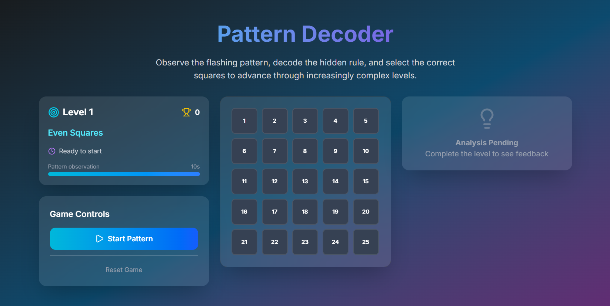

<a name="readme-top"></a>

<br />
<div align="center">
  

  <h3 align="center">Mind Matrix</h3>

  <p align="center">
    Decode the Pattern. Master the Grid.
    <br />
    A cognitive puzzle game built with Next.js 16 & React 19.
    <br />
    <br />
    <a href="https://mindmatrix-pb.vercel.app">View demo</a>
    ·
    <a href="https://github.com/priyanshubh/mind_matrix/issues">Report Bug</a>
    ·
    <a href="https://github.com/priyanshubh/mind_matrix/issues">Request Feature</a>
  </p>
</div>

<div align="center">
  
  
  
  
</div>

<br />

<details>
  <summary>Table of Contents</summary>
  <ol>
    <li><a href="#-about-the-project">About The Project</a></li>
    <li><a href="#-how-to-play">How To Play</a></li>
    <li><a href="#-key-features">Key Features</a></li>
    <li><a href="#-tech-stack">Tech Stack</a></li>
    <li><a href="#-folder-structure">Folder Structure</a></li>
    <li><a href="#-getting-started">Getting Started</a></li>
    <li><a href="#-contributing">Contributing</a></li>
  </ol>
</details>

---

## 🧠 About The Project

**Mind Matrix** is a visual memory and pattern recognition game designed to test your cognitive processing speed. Players are presented with a 5x5 grid where squares flash according to hidden mathematical rules. Your goal is to observe, decode the logic, and replicate the pattern.

Built on the bleeding edge of web development, this project utilizes **Next.js 16**, **React 19**, and the new **Tailwind CSS 4** engine for high-performance rendering and styling.

<div align="center">
  
</div>

---

## 🎮 How To Play

1.  **Observe:** Watch the **5x5 grid** closely. Squares will flash for **10 seconds**.
2.  **Decode:** Analyze the sequence to find the hidden pattern (e.g., primes, diagonals, Fibonacci).
3.  **Select:** Click the squares you believe were part of the pattern.
4.  **Progress:** Advance through **7 levels** of increasing complexity.
5.  **Adapt:** Each level introduces a different mathematical rule you must solve.

---

## 🔥 Key Features

- **🧩 Dynamic Grid System**
  A responsive 5x5 grid component that handles state, user interaction, and visual feedback (`Grid.tsx`, `Square.tsx`).

- **📈 Progressive Difficulty**
  Logic-driven level progression where mathematical rules become harder to decipher as you advance (`levelRules.ts`).

- **🌗 Dark/Light Mode**
  Seamless theme switching powered by `next-themes`, making the game comfortable to play in any lighting (`theme-switch.tsx`).

- **⚡ Real-Time Feedback**
  Instant validation of user selection via the `FeedbackPanel`, letting players know if they cracked the code.

- **🎨 Modern Design**
  Styled with the latest **Tailwind CSS v4**, utilizing new utility class features for a sleek, minimal interface.

---

## ⚙️ Tech Stack

| Category | Technology | Description |
| :--- | :--- | :--- |
| **Framework** |  | The latest iteration of Next.js for blazing fast server-side rendering. |
| **Library** |  | Utilizing React 19 features for optimized DOM updates. |
| **Styling** |  | The newest, high-performance styling engine from Tailwind. |
| **Icons** |  | Lightweight, consistent iconography. |
| **Language** |  | Strictly typed for robust game logic. |

---

## 📂 Folder Structure

```text
mind_matrix/
├── src/
│   └── app/
│       ├── components/       # Game UI Components
│       │   ├── GameControls.tsx
│       │   ├── Grid.tsx
│       │   ├── PatternGame.tsx
│       │   ├── Square.tsx
│       │   └── ...
│       ├── types/            # TypeScript Definitions
│       │   └── game.ts
│       ├── utils/            # Game Logic & Rules
│       │   └── levelRules.ts
│       ├── provider/         # Theme Provider
│       ├── layout.tsx
│       └── page.tsx
├── public/                   # Static Assets
└── package.json
```

---

## 🧰 Getting Started

Follow these steps to run the game locally.

### Prerequisites

* **Node.js** (v20+ recommended)
* **npm** or **yarn**

### Installation

1. **Clone the repository**
```bash
git clone [https://github.com/priyanshubh/mind_matrix.git](https://github.com/priyanshubh/mind_matrix.git)
cd mind_matrix

```


2. **Install dependencies**
```bash
npm install
# or
yarn install

```


3. **Start the development server**
```bash
npm run dev

```


4. **Play the game**
Open [http://localhost:3000](https://www.google.com/search?q=http://localhost:3000) in your browser.

---

## 🔧 Contributing

Contributions are welcome!

1. Fork the Project
2. Create your Feature Branch (`git checkout -b feature/NewPattern`)
3. Commit your Changes (`git commit -m 'Add Fibonacci Pattern'`)
4. Push to the Branch (`git push origin feature/NewPattern`)
5. Open a Pull Request

---


## 🚀 Follow Me

<div align="center">
  <a href="https://github.com/priyanshubh">
    
  </a>
  <a href="https://linkedin.com/in/priyanshu-bharti">
    
  </a>
  <a href="https://priyanshubharti.vercel.app">
    
  </a>
</div>

<br />
<p align="center">Built with ❤️ by <a href="https://www.google.com/search?q=https://github.com/priyanshubh">Priyanshu Bharti</a></p>
